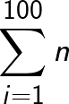
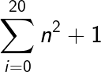

# Making Tedious Arithmetic Fun with Lists and Loops

In this chapter we will learn about how to automate some tedious parts of arithmetic using Python.

## Basic Operators

| Operator       | Syntax | 
|----------------|--------|
| Addition       | +      |
| Subtraction    | -      |
| Multiplication | *      |
| Division       | /      |
| Exponent       | **     |

## Summation

The Python code to calculate this is as follows:-



```python
def summation(num):
    running_sum = 0
    for i in range(1, num + 1):
        running_sum += i
    return running_sum

print(summation(100))
```

The Python code for this one is:-


```python
def summation(num):
    running_sum = 0
    for i in range(num + 1):
        running_sum += i**2 + 1
    return running_sum

print(summation(20))
```

## Exercises

| S. No. | Name                | Source            |
|--------|---------------------|-------------------|
| 01     | Finding the Sum     | [ex1.py](ex1.py/) |
| 02     | Finding the Average | [ex2.py](ex2.py/) |
